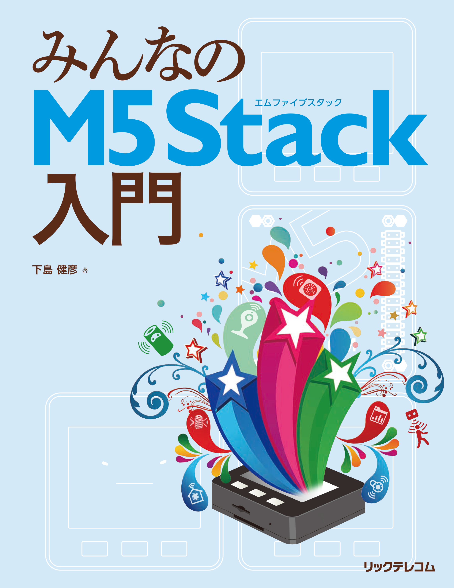

# 「みんなのM5Stack入門」プログラム集

「[みんなのM5Stack入門](https://amzn.to/2nLmvi6)」で取り上げたプログラムです。

* [第3章 M5Stackでプログラミング](./3)
* [第4章 M5Stackで電子工作してみよう(基礎編)](./4)
* [第5章 M5Stackで電子工作してみよう(アドバンスド編)](./5)
* [第6章 ネットワークにつないでみよう](./6)
* [第7章 M5Stackシリーズのニューフェイス M5StickC](./7)
* [補足1 IMU（慣性計測ユニット）MPU6886について](./A1)
